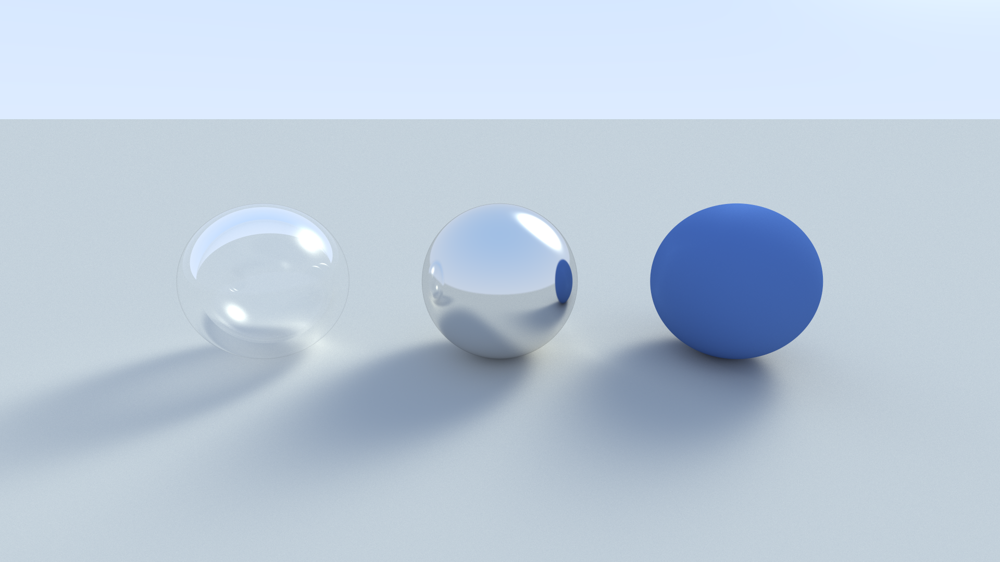

# Simple Ray Tracer in Rust

A classic ray tracer implementation in Rust, built to explore the fundamentals of 3D rendering using path tracing.

This project demonstrates several key ray tracing concepts:
-   **Refraction and Fresnel Effect:** Seen in the glass sphere, which correctly bends light and has more reflective edges.
-   **Specular Reflection:** The chrome sphere acts as a perfect mirror, reflecting other objects in the scene.
-   **Diffuse Shading:** The blue sphere shows smooth Lambertian shading.
-   **Soft Shadows:** Achieved through area light sampling for a more realistic penumbra.

## Example Output


## How to Run
To render the scene, run the following command:
```bash
cargo run --release > image.ppm
```

## Note
Default SAMPLES per scene set to 10'000, you may wanna change it for faster but less realistic render.